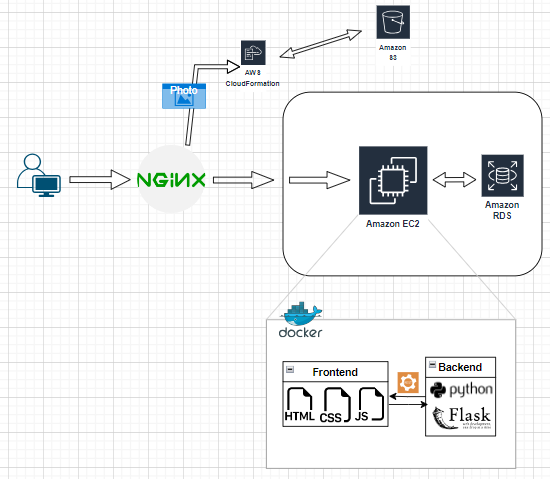

# postgram
測試網址 : http://www.postgram.space:4000/
## About this project
This is a message board where users can upload a photo and provide an explanation about the photo.
The following GIF demonstrates how to upload your picture and post a message on this board.

## Project Struct

### Explanation about the user route
1. The user's request first enters Nginx, acting as a reverse proxy server. Nginx identifies the corresponding server IP based on the domain name in the request.
2. The request enters the EC2 instance, which serves as the virtual server hosting the website. The EC2 instance is responsible for handling user requests and interacting with other services.
3. Within the EC2 instance, communication occurs with Amazon RDS (Relational Database Service) to retrieve previous message records from the database. 
4. Through JavaScript, the EC2 instance passes the retrieved records from RDS to the frontend. The frontend page uses JavaScript code to dynamically render the website content.
5. Ultimately, the page that the user sees on the website includes the previously retrieved records from RDS, allowing the user to view the past activities.
   
### When user post a message
1. When a user uploads a picture and posts a note on the website, the request is directed to the Nginx server, which then identifies the IP address of the hosting server for the website.
2. The user-uploaded picture is routed to CloudFront, Amazon's content delivery network service, and stored in an S3 bucket. CloudFront ensures efficient content delivery and scalability. 
3. Simultaneously, the message content and the location of the uploaded picture in the S3 bucket are inserted into the RDS (Relational Database Service). This step establishes a connection between the message data and the associated image.
4. When a user revisits the website, the server retrieves the stored message data from RDS. 